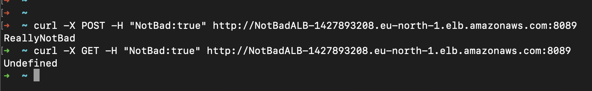

### Test Command
  - `curl -X POST -H "NotBad:true" http://51.20.186.17`
  - `curl -X POST -H "NotBad:true" http://NotBadALB-1427893208.eu-north-1.elb.amazonaws.com:8089`

<br/><br/>
### Execution Results

#### Tests via ALB on port 8089


#### Tests via the EC2 instance IP


### Deployment diagram by ArgoCD


## The Plan Step by Step
### - Develop the app locally
- Python Flask
- Dockerize
- Docker-Compose

### - Provision ( Terraform )
- Network 
- EC2
- ALB ( Optional )
- Security Groups
- ECR
- Dynamically Create Inventory File for Ansible

### - Setup K8s and ArgoCD ( Ansible )
- Setup micro8s
- Enable Ingress
- Enable ArgoCD

### - CI/CD Pipeline ( GitHub Actions )
- Build and push image
  - Create user with ECR push permission
  - Develop the actual pipeline declarations and test
- Create K8s Resource Definitions
  - Deployment
  - Service
  - Ingress
### -  Deploy to K8s
  - Create image pull secret
```
    kubectl create secret docker-registry regcred \
    --docker-server=820469828681.dkr.ecr.eu-north-1.amazonaws.com \
    --docker-username=AWS \
    --docker-password=$(aws ecr get-login-password) \
    --namespace=notbad
```
  - Perform deployment locally via kubectl 
  - Perform deployment with ArgoCD

### - Enable and Configure ArgoCD
  - kubectl port-forward service/argo-cd-argocd-server -n argocd 8080:443
  - After reaching the UI the first time you can login with username: admin and the random password generated during the installation. You can find the password by running:

`kubectl -n argocd get secret argocd-initial-admin-secret -o jsonpath="{.data.password}" | base64 -d`
